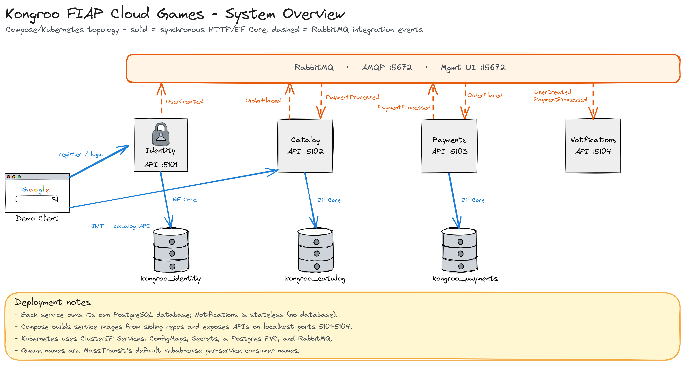
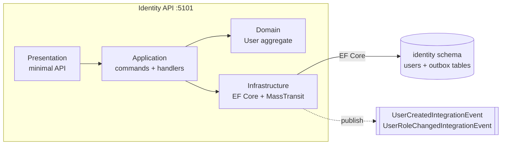
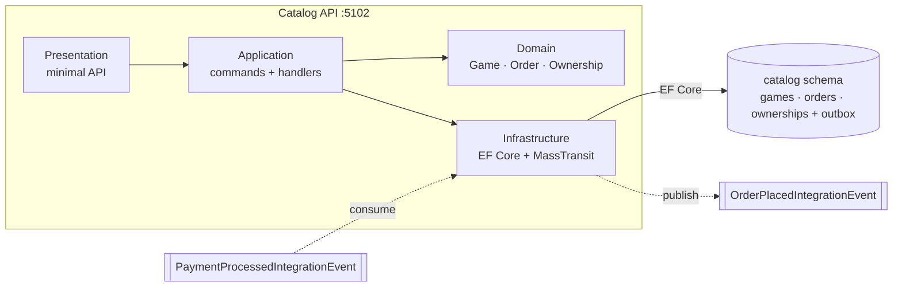
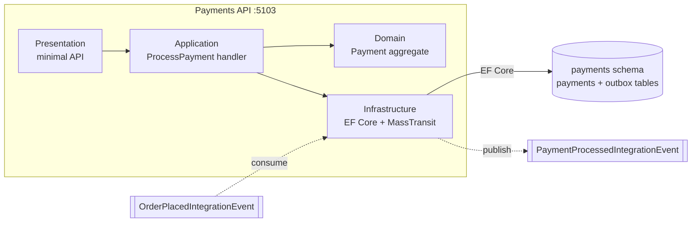
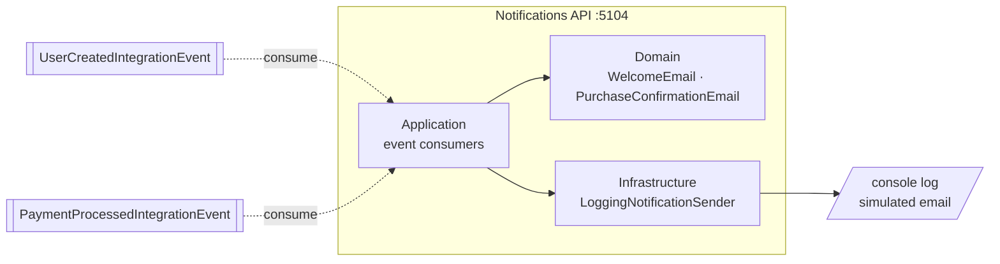
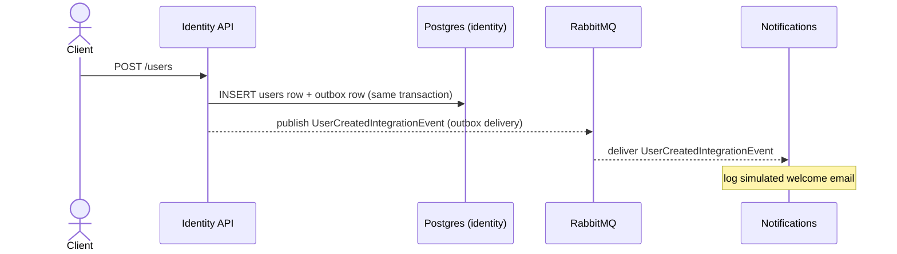
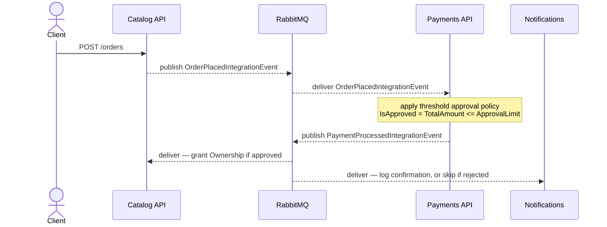

# Kongroo Architecture

Architecture reference for the Kongroo FIAP Cloud Games microservices. Every diagram below is a [Mermaid](https://mermaid.js.org/) block and renders inline on GitHub.

The system is four independent .NET microservices communicating asynchronously over RabbitMQ (via MassTransit), each owning its own PostgreSQL schema, plus a shared orchestration repo (this one) providing Docker Compose and Kubernetes manifests.

| Service | Port | Container Port | Responsibility |
| --- | --- | --- | --- |
| Identity | 5101 | 8080 | User registration, authentication (JWT), authorization |
| Catalog | 5102 | 8080 | Game CRUD, promotions, order placement, user library |
| Payments | 5103 | 8080 | Simulated payment processing (threshold approval) |
| Notifications | 5104 | 8080 | Simulated welcome / purchase-confirmation emails (logged) |

## System Overview

Solid arrows are synchronous HTTP / EF Core calls; dashed arrows are asynchronous RabbitMQ integration events. Each service owns its **own** PostgreSQL database; Notifications is stateless.

> Editable source: [`docs/kongroo-overview.excalidraw`](./docs/kongroo-overview.excalidraw) — open at [excalidraw.com](https://excalidraw.com) (File → Open) or with an Excalidraw editor. Regenerate the diagram (and re-export the PNG) with `node scripts/generate-overview-excalidraw.cjs`.

- Docker Compose builds each service image from its sibling repo and exposes the APIs on localhost ports 5101–5104.
- Kubernetes uses ClusterIP Services, ConfigMaps, Secrets, a shared PostgreSQL PVC, and RabbitMQ.
- Queue names are MassTransit's default kebab-case per-service consumer names — no manual queue naming.
- All services publish through an EF Core transactional outbox (except Notifications, which is stateless), so a message is only published if its database transaction commits.

## Services

### Identity

User registration, authentication (JWT issuance), and authorization. Publishes user lifecycle events; consumes nothing.

| Entity | Fields |
| --- | --- |
| User | Username, Email, PasswordHash, SecurityStamp, Name (PersonName), Role (User/Admin) |

| Endpoint | Description |
| --- | --- |
| `POST /users` | Register a user |
| `GET /users` | List all users (Admin) |
| `GET /users/me` | Current user's profile |
| `GET /users/{userId}` | Get user by id (Admin) |
| `PUT /users/{userId}/role` | Update a user's role (Admin) |
| `POST /tokens` | Login / issue JWT access token |

**Publishes:** `UserCreatedIntegrationEvent(UserId, Email, Name)`, `UserRoleChangedIntegrationEvent(UserId, PreviousRole, CurrentRole)`
**Consumes:** _(none)_
**Tables:** `identity.users` + MassTransit outbox (`outbox_state`, `outbox_message`, `inbox_state`)

### Catalog

Game CRUD, promotions, order placement, and the user's game library. Publishes orders; consumes payment results and grants ownership on approval.

| Entity | Fields |
| --- | --- |
| Game | Title, Description, Price (Money), Status (Draft/Published/...) |
| Promotion | Discount (Percentage), ActiveRange (DateTimeRange) |
| Order | CustomerId, PurchasedAt, Total (Money), Status (Pending/Paid/Rejected), Lines[] |
| OrderLine | GameId, GameTitle, ListPrice, FinalPrice, AppliedPromotionId |
| Ownership | CustomerId, GameId, OrderId, AcquiredAt |

| Endpoint | Description |
| --- | --- |
| `POST /games` | Create game (Admin) |
| `GET /games` | List games |
| `GET /games/{gameId}` | Get game |
| `PUT /games/{gameId}` | Update game (Admin) |
| `DELETE /games/{gameId}` | Delete game (Admin) |
| `POST /games/{gameId}/promotions` | Create promotion (Admin) |
| `GET /orders` | List own orders |
| `GET /orders/{orderId}` | Get order |
| `POST /orders` | Place order (purchase) |
| `GET /ownerships` | List library records |
| `GET /ownerships/{ownershipId}` | Get library record |

**Publishes:** `OrderPlacedIntegrationEvent(OrderId, CustomerId, CustomerEmail, CustomerName, TotalAmount, Currency, Lines[{GameId, UnitPrice}])`
**Consumes:** `PaymentProcessedIntegrationEvent(PaymentId, OrderId, CustomerId, CustomerEmail, CustomerName, TotalAmount, Currency, IsApproved, ProcessedAt)` — grants `Ownership` when `IsApproved` is true
**Tables:** `catalog.games`, `catalog.promotions`, `catalog.orders`, `catalog.order_lines`, `catalog.ownerships` + MassTransit outbox

### Payments

Simulates payment processing for a placed order using a configurable approval threshold.

| Entity | Fields |
| --- | --- |
| Payment | OrderId, CustomerId, Email, CustomerName, Total (Money), Status (Pending/Approved/Rejected), ProcessedAt |

| Endpoint | Description |
| --- | --- |
| `GET /` | List caller's payments (Admin can pass `?customerId=`) |
| `GET /{orderId}` | Get payment by order id |

**Publishes:** `PaymentProcessedIntegrationEvent(PaymentId, OrderId, CustomerId, CustomerEmail, CustomerName, TotalAmount, Currency, IsApproved, ProcessedAt)`
**Consumes:** `OrderPlacedIntegrationEvent` — applies `ThresholdApprovalPolicy`: `IsApproved = TotalAmount <= Payments:ApprovalLimit` (default `1000.00`)
**Tables:** `payments.payments` + MassTransit outbox

> Approval is a pure threshold check on `TotalAmount` — no randomness.

### Notifications

Simulates sending welcome and purchase-confirmation emails by logging them to the console. Stateless and consume-only.

| Transient record | Fields |
| --- | --- |
| WelcomeEmail | To, Name |
| PurchaseConfirmationEmail | To, Name, OrderId, Amount, Currency |

**Publishes:** _(none)_
**Consumes:** `UserCreatedIntegrationEvent` (logs a simulated welcome email), `PaymentProcessedIntegrationEvent` (logs a simulated purchase confirmation when `IsApproved`; otherwise logs a skip note)
**Tables:** _(none — stateless, no database)_

## Event Flows

### User Registration Flow

### Game Purchase Flow

