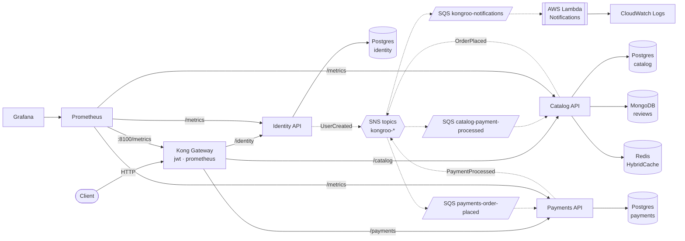
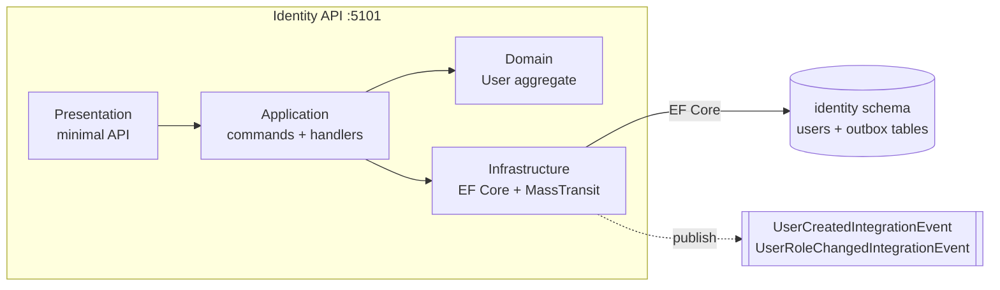
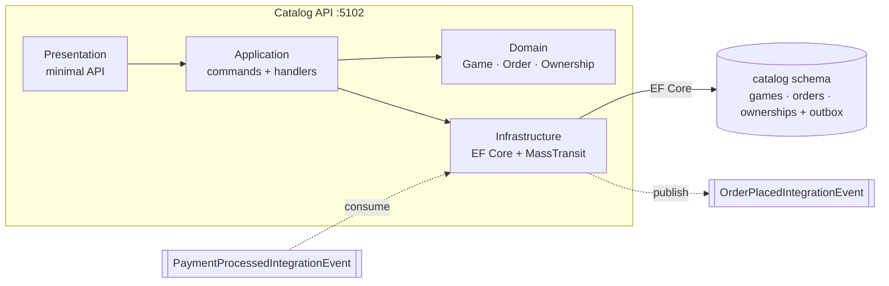
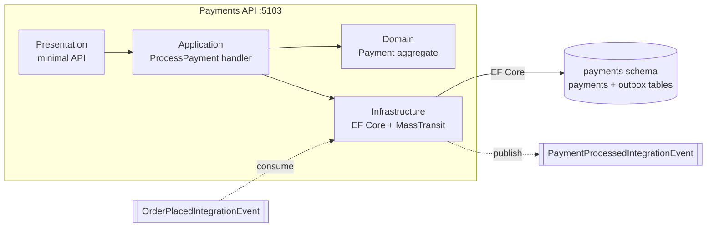
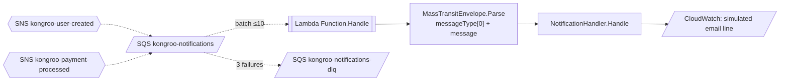
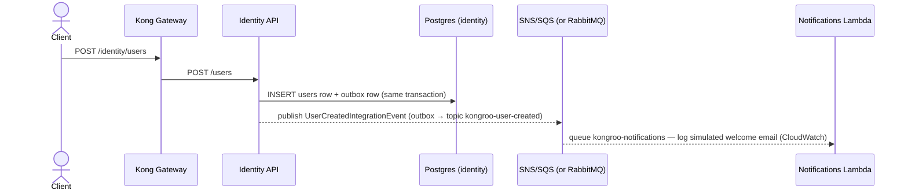
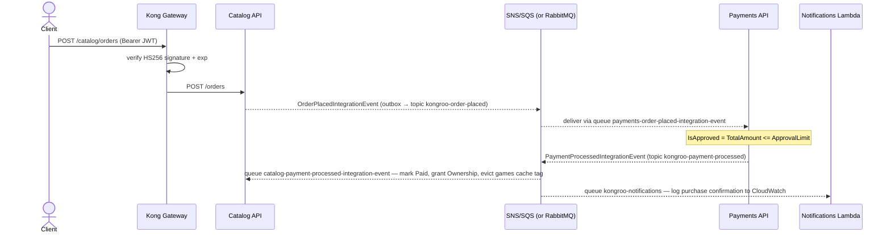

# Kongroo Architecture

Architecture reference for the Kongroo FIAP Cloud Games microservices (Phase 3). Diagrams are
[Mermaid](https://mermaid.js.org/) and render inline on GitHub.

Three .NET 10 microservices sit behind a **Kong API Gateway**, communicate asynchronously through
**MassTransit** (RabbitMQ locally, **Amazon SQS/SNS** when deployed), each own a PostgreSQL schema,
Catalog additionally uses **MongoDB** (reviews) and **Redis** (HybridCache). Notifications is an
**AWS Lambda** triggered by an SQS queue. **Prometheus** scrapes the services and Kong; **Grafana**
shows the dashboard.

See [README.md](./README.md) for how to run the system.

| Component | Kind | Responsibility |
| --- | --- | --- |
| Kong | Gateway | Single entry point, JWT validation, routing, edge metrics |
| Identity | API | Registration, authentication (JWT), authorization |
| Catalog | API | Games, promotions, orders, library, reviews (MongoDB), cached reads (Redis) |
| Payments | API | Threshold-based payment simulation |
| Notifications | Lambda | Simulated welcome / purchase-confirmation emails to CloudWatch |
| Prometheus + Grafana | Observability | Latency, request count by status, error rate, MassTransit rates |

## System Overview

```mermaid
flowchart LR
    client([Client]) -->|HTTP| kong[Kong Gateway<br/>jwt · prometheus]
    kong -->|/identity| identity[Identity API]
    kong -->|/catalog| catalog[Catalog API]
    kong -->|/payments| payments[Payments API]

    identity --> pgi[(Postgres<br/>identity)]
    catalog --> pgc[(Postgres<br/>catalog)]
    catalog --> mongo[(MongoDB<br/>reviews)]
    catalog --> redis[(Redis<br/>HybridCache)]
    payments --> pgp[(Postgres<br/>payments)]

    identity -.->|UserCreated| sns{{SNS topics<br/>kongroo-*}}
    catalog -.->|OrderPlaced| sns
    payments -.->|PaymentProcessed| sns
    sns -.-> sqsp[/SQS payments-order-placed/] -.-> payments
    sns -.-> sqsc[/SQS catalog-payment-processed/] -.-> catalog
    sns -.-> sqsn[/SQS kongroo-notifications/] -.-> lambda[[AWS Lambda<br/>Notifications]] --> cw[CloudWatch Logs]

    prom[Prometheus] -->|/metrics| identity
    prom -->|/metrics| catalog
    prom -->|/metrics| payments
    prom -->|:8100/metrics| kong
    grafana[Grafana] --> prom
```

- Solid arrows are synchronous HTTP / driver calls; dashed arrows are asynchronous integration events.
- With `Messaging__Transport=RabbitMq` (compose, tests) the SNS/SQS pair is RabbitMQ exchanges/queues
  with identical semantics; MassTransit's EF Core outbox guarantees publish-after-commit either way.
- SNS topic names are fixed by contract (`MessagingTopics` in each service; `template.yaml` in
  Notifications): `kongroo-user-created`, `kongroo-user-role-changed`, `kongroo-order-placed`,
  `kongroo-payment-processed`. On Amazon SNS, `kongroo-user-role-changed` is created lazily — it only
  appears once a role change is actually published — so its absence on a fresh stack is expected, not a
  failure.
- Compose and Kubernetes both expose Kong on `localhost:8000` (k8s: LoadBalancer port 8000 on Rancher Desktop, whose Traefik owns port 80). Run one mode at a time.

## Services

### Identity

User registration, authentication (JWT issuance), and authorization. Publishes user lifecycle events; consumes nothing.

```mermaid
flowchart LR
    subgraph identity[Identity API :5101]
        direction TB
        pres[Presentation<br/>minimal API]
        app[Application<br/>commands + handlers]
        dom[Domain<br/>User aggregate]
        inf[Infrastructure<br/>EF Core + MassTransit]
        pres --> app
        app --> dom
        app --> inf
    end
    inf -->|EF Core| db[(identity schema<br/>users + outbox tables)]
    inf -.->|publish| ev[[UserCreatedIntegrationEvent<br/>UserRoleChangedIntegrationEvent]]
```

| Entity | Fields |
| --- | --- |
| User | Username, Email, PasswordHash, SecurityStamp, Name (PersonName), Role (User/Admin) |

| Endpoint | Description |
| --- | --- |
| `POST /users` | Register a user |
| `GET /users` | List all users (Admin) |
| `GET /users/me` | Current user's profile |
| `GET /users/{userId}` | Get user by id (Admin) |
| `PUT /users/{userId}/role` | Update a user's role (Admin) |
| `POST /tokens` | Login / issue JWT access token |

**Publishes:** `UserCreatedIntegrationEvent(UserId, Email, Name)`, `UserRoleChangedIntegrationEvent(UserId, PreviousRole, CurrentRole)`
**Consumes:** _(none)_
**Tables:** `identity.users` + MassTransit outbox (`outbox_state`, `outbox_message`, `inbox_state`)

### Catalog

Game CRUD, promotions, order placement, and the user's game library. Publishes orders; consumes payment results and grants ownership on approval.

```mermaid
flowchart LR
    subgraph catalog[Catalog API :5102]
        direction TB
        pres[Presentation<br/>minimal API]
        app[Application<br/>commands + handlers]
        dom[Domain<br/>Game · Order · Ownership]
        inf[Infrastructure<br/>EF Core + MassTransit]
        pres --> app
        app --> dom
        app --> inf
    end
    inf -->|EF Core| db[(catalog schema<br/>games · orders · ownerships + outbox)]
    inf -.->|publish| out[[OrderPlacedIntegrationEvent]]
    inc[[PaymentProcessedIntegrationEvent]] -.->|consume| inf
```

| Entity | Fields |
| --- | --- |
| Game | Title, Description, Price (Money), Status (Draft/Published/...) |
| Promotion | Discount (Percentage), ActiveRange (DateTimeRange) |
| Order | CustomerId, PurchasedAt, Total (Money), Status (Pending/Paid/Rejected), Lines[] |
| OrderLine | GameId, GameTitle, ListPrice, FinalPrice, AppliedPromotionId |
| Ownership | CustomerId, GameId, OrderId, AcquiredAt |
| Review (MongoDB) | GameId, CustomerId, CustomerName, Rating 1–5, Text?, CreatedAt — unique (GameId, CustomerId) |

| Endpoint | Description |
| --- | --- |
| `POST /games` | Create game (Admin) |
| `GET /games` | List games |
| `GET /games/{gameId}` | Get game |
| `PUT /games/{gameId}` | Update game (Admin) |
| `DELETE /games/{gameId}` | Delete game (Admin) |
| `POST /games/{gameId}/promotions` | Create promotion (Admin) |
| `GET /orders` | List own orders |
| `GET /orders/{orderId}` | Get order |
| `POST /orders` | Place order (purchase) |
| `GET /ownerships` | List library records |
| `GET /ownerships/{ownershipId}` | Get library record |
| `POST /games/{gameId}/reviews` | Submit a review (one per customer per game) |
| `GET /games/{gameId}/reviews` | Average rating, count, latest reviews |

**Publishes:** `OrderPlacedIntegrationEvent(OrderId, CustomerId, CustomerEmail, CustomerName, TotalAmount, Currency, Lines[{GameId, UnitPrice}])`
**Consumes:** `PaymentProcessedIntegrationEvent(PaymentId, OrderId, CustomerId, CustomerEmail, CustomerName, TotalAmount, Currency, IsApproved, ProcessedAt)` — grants `Ownership` when `IsApproved` is true
**Tables:** `catalog.games`, `catalog.promotions`, `catalog.orders`, `catalog.order_lines`, `catalog.ownerships` + MassTransit outbox
**MongoDB:** `kongroo_catalog.reviews` (via `MongoDB.Driver`)
**Cache:** `HybridCache` (Redis L2 5 min, in-process L1 1 min) on `GET /games` and `GET /games/{id}`; tag `games` evicted by every game/promotion write

### Payments

Simulates payment processing for a placed order using a configurable approval threshold.

```mermaid
flowchart LR
    subgraph payments[Payments API :5103]
        direction TB
        pres[Presentation<br/>minimal API]
        app[Application<br/>ProcessPayment handler]
        dom[Domain<br/>Payment aggregate]
        inf[Infrastructure<br/>EF Core + MassTransit]
        pres --> app
        app --> dom
        app --> inf
    end
    inf -->|EF Core| db[(payments schema<br/>payments + outbox tables)]
    inc[[OrderPlacedIntegrationEvent]] -.->|consume| inf
    inf -.->|publish| out[[PaymentProcessedIntegrationEvent]]
```

| Entity | Fields |
| --- | --- |
| Payment | OrderId, CustomerId, Email, CustomerName, Total (Money), Status (Pending/Approved/Rejected), ProcessedAt |

| Endpoint | Description |
| --- | --- |
| `GET /` | List caller's payments (Admin can pass `?customerId=`) |
| `GET /{orderId}` | Get payment by order id |

**Publishes:** `PaymentProcessedIntegrationEvent(PaymentId, OrderId, CustomerId, CustomerEmail, CustomerName, TotalAmount, Currency, IsApproved, ProcessedAt)`
**Consumes:** `OrderPlacedIntegrationEvent` — applies `ThresholdApprovalPolicy`: `IsApproved = TotalAmount <= Payments:ApprovalLimit` (default `1000.00`)
**Tables:** `payments.payments` + MassTransit outbox

> Approval is a pure threshold check on `TotalAmount` — no randomness.

### Notifications (AWS Lambda)

Serverless replacement for the Phase 2 container. Triggered by SQS, deployed with SAM to an AWS Academy
Learner Lab account (`LabRole`), logs to CloudWatch.

```mermaid
flowchart LR
    t1{{SNS kongroo-user-created}} -.-> q[/SQS kongroo-notifications/]
    t2{{SNS kongroo-payment-processed}} -.-> q
    q -.->|batch ≤10| fn[[Lambda Function.Handle]]
    fn --> parse["MassTransitEnvelope.Parse<br/>messageType[0] + message"]
    parse --> handler[NotificationHandler.Handle]
    handler --> log[/CloudWatch: simulated email line/]
    q -.->|3 failures| dlq[/SQS kongroo-notifications-dlq/]
```

| Transient record | Fields |
| --- | --- |
| WelcomeEmail | To, Name |
| PurchaseConfirmationEmail | To, Name, OrderId, Amount, Currency |

**Consumes:** `UserCreatedIntegrationEvent` (welcome), `PaymentProcessedIntegrationEvent` (confirmation when `IsApproved`, skip line otherwise). Unknown types are acknowledged.
**Error handling:** malformed records are reported as partial batch failures and retried alone; after 3 receives they land in the DLQ.
**IaC:** `template.yaml` (topics, queue, DLQ, raw-delivery subscriptions, queue policy, function, log group).

## Gateway

Kong Gateway 3.9 OSS, DB-less, one declarative file (`Kongroo.Orchestration/k8s/kong/kong.yaml`).
Routes strip the prefix and proxy to the ClusterIP Services on port 8080. The `jwt` plugin holds one
consumer (`identity`) whose credential key is the issuer `Kongroo.Identity.Api` and whose secret is the
shared HS256 development signing key (inline; Kong 3.9 OSS does not dereference vault references in that
field, so Kubernetes mounts the file from a Secret). Register and login are the
only anonymous routes; all others return Kong's 401 before reaching a service. The `prometheus` plugin
exposes edge metrics on the status port 8100.

## Observability

Identity, Catalog and Payments register OpenTelemetry metrics (ASP.NET Core, HttpClient, runtime,
MassTransit meter) and expose them with the Prometheus exporter at `/metrics`. Prometheus scrapes four
static targets (three APIs, Kong). Grafana provisions the **Kongroo** dashboard from
`k8s/grafana/dashboards/kongroo.json`. Lambda logs live in CloudWatch.

## Event Flows

### User Registration Flow

```mermaid
sequenceDiagram
    actor Client
    participant Kong as Kong Gateway
    participant Identity as Identity API
    participant DB as Postgres (identity)
    participant Bus as SNS/SQS (or RabbitMQ)
    participant Lambda as Notifications Lambda

    Client->>Kong: POST /identity/users
    Kong->>Identity: POST /users
    Identity->>DB: INSERT users row + outbox row (same transaction)
    Identity-->>Bus: publish UserCreatedIntegrationEvent (outbox → topic kongroo-user-created)
    Bus-->>Lambda: queue kongroo-notifications — log simulated welcome email (CloudWatch)
```

### Game Purchase Flow

```mermaid
sequenceDiagram
    actor Client
    participant Kong as Kong Gateway
    participant Catalog as Catalog API
    participant Bus as SNS/SQS (or RabbitMQ)
    participant Payments as Payments API
    participant Lambda as Notifications Lambda

    Client->>Kong: POST /catalog/orders (Bearer JWT)
    Kong->>Kong: verify HS256 signature + exp
    Kong->>Catalog: POST /orders
    Catalog-->>Bus: OrderPlacedIntegrationEvent (outbox → topic kongroo-order-placed)
    Bus-->>Payments: deliver via queue payments-order-placed-integration-event
    Note over Payments: IsApproved = TotalAmount <= ApprovalLimit
    Payments-->>Bus: PaymentProcessedIntegrationEvent (topic kongroo-payment-processed)
    Bus-->>Catalog: queue catalog-payment-processed-integration-event — mark Paid, grant Ownership, evict games cache tag
    Bus-->>Lambda: queue kongroo-notifications — log purchase confirmation to CloudWatch
```

Verified end to end through Kong on the `0.1.0` images: anonymous, no-token and tampered-token requests
all get 401; register → login → publish a game → order settles `Paid` → ownership granted → payment
`Approved 19.99 USD`; the Lambda logged `Sending welcome email to …` at registration and
`Sending purchase confirmation email to … 19.99 USD.` after settlement; a review write went to MongoDB
(`ux_reviews_game_customer` unique index); the second cached game read took 9 ms against 159 ms for the
first.
